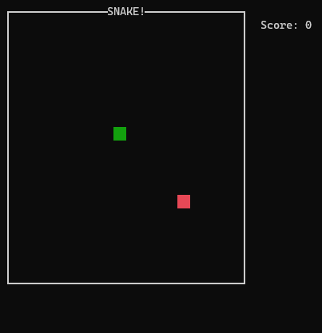

# Snake.jl 

The game of snake in the Julia REPL. 🟩🟩🟩🟩🟩&nbsp;&nbsp;&nbsp;&nbsp;&nbsp;🍎

<p align="center">
  
</p>


> Modified from [Chris DeLeon's 4:30 minute Javascript version](https://youtu.be/xGmXxpIj6vs).

## Installation
```julia
] add Snake
```

## Gameplay
```julia
using Snake
```
The game will start automatically.
- Hit `backtick` to pause the game.
- Resume with `play()` or restart the game with `restart()`


## Controls (wasd)
* `a` and `d` to apply left and right velocity
* `s` to apply down velocity
* `w` to apply up velocity
* `backtick` to pause, then `play()` to resume


## Emoji support
To play using emojis, run:

```julia
play(emoji=true)
```
<p align="center">
  
</p>

## Other options
- `play(walls=true)`: Restart the game when hitting walls (default `false`)
- `play(size=(20,20))`: Change game field dimensions (default `(20,20)`)


---
[Robert Moss](http://web.stanford.edu/~mossr)
